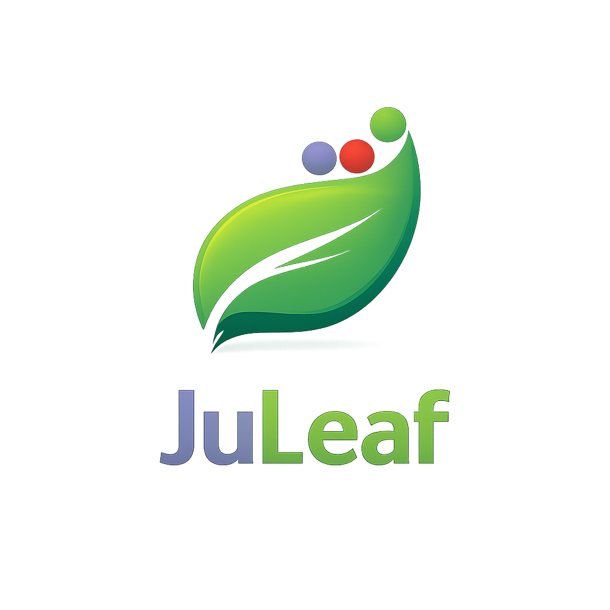

# 🍃 Juleaf

<p align="center">
  
</p>

<p align="center">
  <strong>Julia + Weave + LaTeX</strong> — Scientific documents with executable code.
</p>

<p align="center">
  
</p>

## 1. Features

- 📝 Julia code execution in documents
- 📐 LaTeX math rendering
- 📄 PDF output (Research paper, Presentation slide, Letters)
- ✨ AI assistant compatible (Groq, Claude, etc.)
- 🌙 Dark mode

## 2. Install
### 2.1. Julia

**macOS**
```bash
brew install julia
```

**Ubuntu/Debian**
```bash
curl -fsSL https://install.julialang.org | sh
```

**Windows**  
Follow the instructions provided by [julialang.org](https://julialang.org/downloads/)

to confirm that Julia is installed, open a terminal and run the following line: 
```bash
julia --version
```

### 2.2. TinyTeX (LaTeX)

**macOS/Linux**
```bash
curl -sL "https://yihui.org/tinytex/install-bin-unix.sh" | sh
```

**Windows**
```powershell
Invoke-WebRequest -Uri "https://yihui.org/tinytex/install-windows.bat" -OutFile "install.bat"; .\install.bat
```

### 2.3. Pandoc
for conversion from file.jmd to file.pdf
**macOS**
```bash
brew install pandoc
```

**Ubuntu/Debian**
```bash
sudo apt install pandoc
```

**Windows**  
Follow the instructions provided by [pandoc.org](https://pandoc.org/installing.html)

### 2.4. Juleaf

```bash
git clone https://github.com/bakimane/juleaf.git
cd juleaf
julia -e 'using Pkg; Pkg.add(["HTTP", "Weave"])'
julia juleaf.jl
```

Open http://localhost:8080

## 3. Templates

| Template | Use Case |
|----------|----------|
| Article | Reports, papers |
| IEEE | Conference papers |
| Beamer | Presentations |
| Letter | Formal letters |
| Math | Theorems, proofs |

## 4. Shortcuts

| Key | Action |
|-----|--------|
| `Ctrl+S` | Save + Compile |
| `Ctrl+Enter` | Compile |
| `Ctrl+I` | AI assist |

## 5. Contributing

We welcome contributions! Please see our [Contributing Guide](CONTRIBUTING.md) for details.

## 6. AI (Optional)

1. Get free key at [console.groq.com](https://console.groq.com)
2. Click ✨ AI → paste key

## 7. License

This project is licensed under MIT License - see the [LICENSE](LICENSE) file for details.